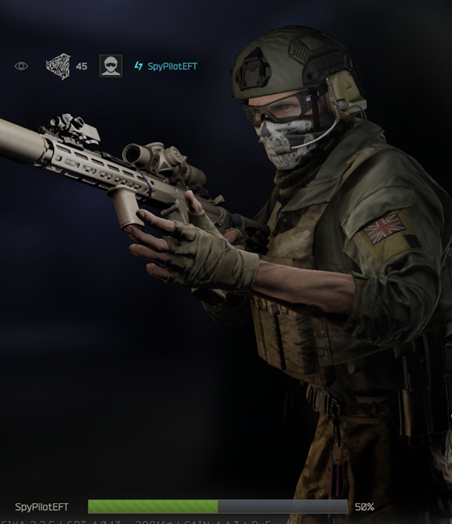
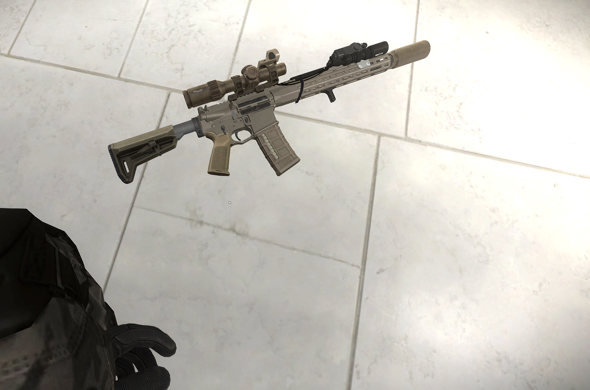
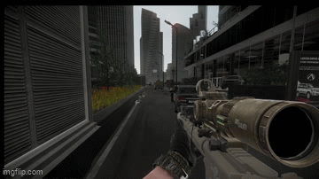
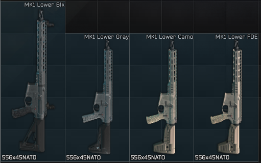

# Spy's KAC KS-1






SPT 4.0.13 weapon mod adding Knight's Armament KS-1 and SOLGW MK1 variants, parts, presets, and Peacekeeper assort entries.

Current release: 1.0.5

## Source

The C# source used for the server loader DLL is in `src/KAC_KS1`.

## Install

Open the release archive. It is structured like this:

```txt
SPT
+-- user
    +-- mods
        +-- spys-kac-ks1
```

Drag the `SPT` folder from the archive into the same place you keep your SPT install and allow Windows to merge folders.

This mod is server-side only. There is no BepInEx plugin for the KS-1.

## Credits

- SpyPilot: mod author
- EpicRangeTime: shaders
- bobinstein: Unity, Blender, and shader help

Please credit both bobinstein and EpicRangeTime when redistributing, mirroring, or showcasing this mod.

## Notes

- Built for SPT 4.0.13.
- Requires WTT-ServerCommonLib.
- Bundles include the custom shader/assets needed by the mod.

## Known Issues

- Failure-to-eject animation still needs to be fixed.
- The SOLGW MK1 12.75-inch Gray handguard currently uses the `grey` bundle, which displays the wrong length. The matching `gray` bundle was removed because it causes the large red in-game item error.

## Changelog

### 1.0.5

- Added SOLGW MK1 weapon variants in Black, FDE, Camo, and Grey.
- Fixed the KS-1 audio glitch. Thanks to bobinstein for the fix.
- Fixed KS-1 backpack compatibility so backpacks can no longer attach to the top rail.

### 1.0.4

- Removed leftover `epic_shaders.bundle` dependency references from `bundles.json`.
- This is a cleanup-only change. The dependency was not required by the included shader bundle and should not affect visuals or functionality.
